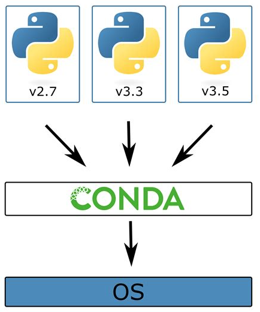

# Setting up the Python Development Environment
---
## Activities
- Hands-on installation of Python/Anaconda.
- Setting up Jupyter Notebook.
- Create a virtual environment using conda and pip and install required libraries  (NumPy, Pandas, Matplotlib, scikit-learn, etc.).
- learn how to use Google Colab which provides Jupyter notebook environment with support for Python.
  
---
## What is Anaconda?

- Anaconda is a popular **open-source distribution** of Python and R programming languages.
- It simplifies **package management** and **environment management**.
- Designed for **data science**, **machine learning**, **AI**, and **scientific computing**.
- Comes with a **collection of pre-installed libraries** like NumPy, Pandas, Matplotlib, SciPy, Scikit-learn, and more.
- Includes tools like **Jupyter Notebook**, **Spyder**, and **Conda** for streamlined development.

## Importance of Anaconda for Python and Machine Learning Projects

- **Easy Package Management**: Anaconda uses `conda` to install, update, and manage Python packages, avoiding compatibility issues.
- **Environment Isolation**: Allows creation of `isolated virtual environments` for different projects to prevent library conflicts.
- **Pre-installed Libraries**: Provides a rich ecosystem of `pre-installed libraries` essential for machine learning and data analysis.
- **Simplified Development**: Tools like `Jupyter Notebook` make it easy to write and test Python code interactively.
- **Cross-Platform Support**: Available for `Windows`, `macOS`, and `Linux`, ensuring flexibility across different systems.
- **Community and Support**: Widely used in the `data science community`, making it easier to find resources, tutorials, and support.
- **Optimized for Machine Learning**: Includes popular libraries like TensorFlow, Keras, PyTorch, and Scikit-learn for ML projects.
- **Visualization Tools**: Comes with libraries like Matplotlib, Seaborn, and Plotly for creating insightful visualizations.
- **Scalable**: Suitable for both beginners and advanced users, with capabilities to scale from small projects to complex workflows.
  
---

## Install Anaconda/Python on Windows OS

Follow these steps to install Anaconda on your Windows machine:

### Step 1: Download the Installer
- Visit the official [Anaconda Distribution page](https://www.anaconda.com/products/distribution).
- Download the latest Anaconda installer for Windows.

### Step 2: Launch the Installer
- Navigate to your **Downloads** folder.
- Double-click the downloaded installer to start the installation process.

### Step 3: Start the Installation
- Click **Next** on the welcome screen.

### Step 4: Accept the License Agreement
- Read the licensing terms.
- Click **I Agree** to proceed.

> **Tip:** It is recommended to select "Just Me" during installation. This ensures Anaconda is installed only for the current user.

### Step 5: Choose Installation Type
- Click **Next** to confirm your installation type.

### Step 6: Select Installation Folder
- Choose a destination folder for Anaconda.
- Click **Next** to proceed.

> **Important:**  
> - Avoid installing Anaconda in a directory path that contains spaces or Unicode characters.  
> - Do not install as Administrator unless admin privileges are necessary.  
> - **Do not add Anaconda to the PATH environment variable**, as this may cause conflicts with other software.

### Step 7: Install Anaconda
- Click **Install** and wait for the installation to complete.
- Click **Next** to proceed.

### Step 8: Finish Installation
- After a successful installation, you will see the "Thanks for installing Anaconda" dialog box.

### Additional Resources
For more detailed information, refer to the [Anaconda Installation Documentation](https://docs.anaconda.com/anaconda/install/windows/).

---

## Virtual Environment

When installing Python on your machine, you have the option to install it `system-wide` or in a `virtual environment`.

- Installing Python system-wide may seem like the most straightforward approach, it can lead to several problems such as `Dependency conflicts` and `Version conflicts`
- Installing Python in a virtual environment provides several benefits such as `Isolation`, `Dependency management`, and `Reproducibility`.

A **virtual environment** is an isolated Python environment that allows you to manage dependencies for different projects without conflicts. Below are step-by-step guides for creating virtual environments using **Conda** and **pip**.

## Python Environment Management with Conda

- **Package Manager**: Conda is a powerful package manager for managing software dependencies and virtual environments.
- **Cross-Language Support**: Supports multiple languages, including Python, R, and others.
- **Environment Isolation**: Enables the creation of isolated environments to prevent package conflicts.
- **Non-Python Packages**: Manages non-Python dependencies like libraries and tools.
- **Built-in with Anaconda**: Comes pre-installed with the Anaconda and Miniconda distributions.
- **Integrated Tools**: Works seamlessly with Jupyter Notebook and other tools.

  

### Verify Conda Installation

```bash
conda --version
```

### To list of all available environments
```bash
conda info --envs
conda env list
```

### Verify Python Installation
```bash
python --version
```
> **Important:**  
> - Ensure Conda is installed. If not, install Anaconda or Miniconda.

### Create a New Environment

```bash
conda create --name my_env python=3.9
conda create -n my_env python=3.9
```
> **Important:**  
> - Replace my_env with your desired environment name and 3.9 with your preferred Python version.

### Activate the Environment
```bash
conda activate my_env
```
### Install Required Packages
```bash
conda install packages_name 
conda install numpy pandas matplotlib notebook
```

### Uninstall packages
```bash
conda uninstall packages_name
conda uninstall numpy
```
### Search for packages
```bash
conda search packages_name
conda search numpy
```
### Update packages

```bash
conda update packages_name
conda update numpy
```
### List installed packages
```bash
conda list
```
### Sharing python environment

#### Export the environment
```bash
conda env export > environment.yml
conda env export --from-history > environment.yml
```
#### Install the environment from the environment.yml file
```bash
conda env create -f environment.yml
```
### Deactivate the Environment
```bash
conda deactivate
```
### Remove an Environment 
```bash
conda remove --name my_env
conda remove -n my_env
conda remove 
```
---

## Python Environment management with pip

 **Python Default Package Manager**: pip is the standard/default package manager for Python.
- **Lightweight**: Designed for Python-only projects and lightweight environments.
- **Virtual Environment Support**: Works with `venv` or `virtualenv` to create isolated environments.
- **Ease of Use**: Simple syntax for installing and managing packages.
- **Community Driven**: Extensive library ecosystem supported by the Python community.
- **Customizable Requirements**: Supports dependency management with `requirements.txt` files.

### Virtual Environment using Windows Command Prompt

### Create a Virtual Environment
```bash
python -m venv my_env
```
### Activate the Virtual Environment

#### On Windows
```bash
my_env\Scripts\activate
```
#### On macOS/Linux
```bash
source my_env/bin/activate
```
### To upgrade pip
```bash
`python.exe -m pip install --upgrade pip`
```
### Install Required Packages
```bash
pip install numpy pandas matplotlib notebook
```
### Deactivate the Virtual Environment
```bash
deactivate
```
### Remove the Virtual Environment (Optional)

#### On Windows
```bash
rmdir /s my_env
```
#### On macOS/Linux
```bash
rm -r my_env
```
---
### Virtual Environment using Windows Power-Shell

### Verify Python Installation
```bash
python --version
```

### Create a Virtual Environment
```bash
python -m venv my_env
```
### Activate the Virtual Environment
```bash
.\my_env\Scripts\Activate
```

### Install Required Packages
```bash
pip install numpy pandas matplotlib notebook
```

### Deactivate the Virtual Environment
```bash
deactivate
```
### Remove the Virtual Environment (Optional)
```bash
Remove-Item -Recurse -Force .\my_env
```

## Interactive Development Environments

### Jupyter Notebooks

- `Jupyter Notebooks` are a versatile tool for professionals, researchers, educators, and learners, providing an `interactive` and `collaborative` environment for coding, documentation, and visualization.

### 1. Interactive Computing
- **Real-Time Execution**: Write, execute, and modify code interactively in real-time.
- **Experimentation**: Ideal for experimenting with algorithms, models, and data.
- **Visualization**: Allows seamless integration of code and visual outputs for data exploration.

### 2. Documentation
- **Comprehensive Notes**: Combine code, text (using Markdown), images, and equations in one place.
- **Collaboration Ready**: Simplifies sharing results and collaborating with others.

### 3. Reproducibility
- **Self-Contained Workflows**: Combine code, data, and outputs in one notebook.
- **Ease of Sharing**: Facilitates sharing and verification of results.
- **Research Expansion**: Enables others to build on your work effortlessly.

### 4. Flexibility
- **Multi-Language Support**: Supports multiple languages like Python, R, Julia, and more.

### 5. Data Visualization
- **Visual Insights**: Supports libraries like Matplotlib, Seaborn, Plotly, and more.
- **Communicate Results**: Create professional charts, graphs, and interactive visualizations.

### 6. Education
- **Learning Platform**: Widely used for teaching programming, data analysis, and machine learning.
- **Interactive Learning**: Provides hands-on experiences to engage students and reinforce concepts.
- **Instructor-Friendly**: Allows instructors to create interactive tutorials and demonstrations.


### Launching Jupyter Notebook (Hands-on)

#### Using the Anaconda Prompt 

1) Open the Anaconda Prompt terminal and run the following command to start Jupyter Notebook

```bash
jupyter-notebook
jupyter-notebook
```
> **Important:**  
> - This will open the Jupyter interface in your default web browser with the file extension `.ipynb.`
> - The landing page displays your file directory.

#### Using the Anaconda Navigator  

1) Open the `Anaconda Navigator` from the `Windows Start` and select the desired `Environment`

2) Click on **Open with Jupyter Notebook**.

3) Select the `desired folder` or create a `new folder` (Click `New` in top-right corner and create `Newfolder`)

4) Click New in the top-right corner and select Python 3 (ipykernel) 

5) A new notebook will open with the file extension `.ipynb.`

### Basic Features of Jupyter Notebook

 There are two main cell types that we will cover:

1) **Cells**
 - `Code cell`: contains code to be executed in the kernel. When the code is run, the notebook displays the output below the code cell that generated it.

   - Press `A` or `B` to insert a new cell above or below the active cell.
   - `M` : will transform the active cell to a Markdown cell.
   - `Y` : will set the active cell to a code cell.
   - `D + D` : (D twice) will delete the active cell.
   - `Z` : will undo cell deletion.
   - `Shift + Enter` : to run a cell
   
 - `Markdown cells`: cell contains text formatted using Markdown and displays its output in-place when the Markdown cell is run. Markdown is a lightweight, easy to learn markup language for formatting plain text.

#### Headings

```bash
# This is a level 1 heading
## This is a level 2 heading
```

#### Plain text formatting
```bash
 **bold** or __bold__
 *italic* or _italic_
```

#### Paragraphs must be separated by an empty line.

```bash
* Sometimes we want to include lists.
* Which can be bulleted using asterisks.

1. Lists can also be numbered.
2. If we want an ordered list.
```

#### Hyperlinks

[It is possible to include hyperlinks](yonsci.github.io/gdp-nowcasting-ml/)

#### Inline code 

```
bar()
```

#### Images 
```bash
 
```

2) `kernel`:  It's the `computational engine` that runs your code. When you write code in a notebook and ask it to run, the kernel is what takes that code, processes it, and gives you the results.

#### Importing Libraries and Writing Code

```bash
import numpy as np
import pandas as pd
import matplotlib.pyplot as plt

# Example: Create a simple plot
x = np.linspace(0, 10, 100)
y = np.sin(x)
plt.plot(x, y)
plt.title("Sine Wave")
plt.show()
```
#### Saving and Exporting
- Save your notebook: Click the Save icon or press `Ctrl + S`.
- Export to different formats: Go to File > Download as and choose formats like `.html` or `.pdf`

## Integrated Development Environment (IDE) (Optional)

`Integrated Development Environment (IDE)` is a software application that provides comprehensive tools for `coding`, `debugging`, and `managing Python projects`. It streamlines development by integrating features like `syntax highlighting`, `code completion`, `debugging`, and `version control`.

### Key Features to Look for in an IDE
- **Code Completion**: Auto-suggests methods, variables, and functions.
- **Debugging Tools**: Step through your code to identify and fix issues.
- **Integrated Terminal**: Run Python scripts directly from the IDE.
- **Version Control**: Built-in support for Git to manage project versions.
- **Plugin Support**: Extend functionality with custom plugins or extensions.

### Types of IDEs for Python

These IDEs support multiple programming languages, including Python.
- **PyCharm**: A feature-rich IDE with smart code completion, debugging, and built-in testing tools. Ideal for both beginners and advanced users.
- **Visual Studio Code (VS Code)**: A lightweight, highly customizable IDE with Python extensions for code linting, debugging, and virtual environment support.
- **Spyder**: Popular among data scientists for its integration with scientific libraries like NumPy, Pandas, and Matplotlib. It is also a Python specific IDE.  

### How to Install Visual Studio Code (VS Code)

Visual Studio Code (VS Code) is a `lightweight`, `versatile`, and powerful `code editor` for Python and many other languages. 

#### Step 1: Download VS Code
1. Visit the official [VS Code website](https://code.visualstudio.com/).
2. Click on the **Download for Windows**, **macOS**, or **Linux** button based on your operating system.


####  Step 2: Install VS Code
#### On Windows
1. Locate the downloaded `.exe` file in your **Downloads** folder.
2. Double-click the file to start the installation process.
3. Follow the setup wizard:
   - Accept the license agreement.
   - Choose an installation location or use the default.
   - Select optional tasks, such as:
     - Create a desktop shortcut.
     - Add "Open with Code" to context menus.
     - Register VS Code as the default editor for supported file types.
4. Click **Install** and wait for the installation to complete.

#### On macOS
1. Open the downloaded `.dmg` file.
2. Drag the **Visual Studio Code** icon into the **Applications** folder.
3. Open **Launchpad** or **Finder** to locate and run VS Code.

#### On Linux
1. Open a terminal
2. Install the `.deb` or `.rpm` package using your package manager. 
   
   ```bash
   sudo apt install ./<file>.deb    # For Debian-based systems
   sudo rpm -i <file>.rpm          # For Red Hat-based systems
   ```

### Launch/Open VS Code

- On Windows: Use the desktop shortcut or search for "Visual Studio Code" in the Start menu.
- On macOS/Linux: Open it from Launchpad, Finder, or the terminal (code command if set up).
  
> **Important:**  
> - On the first launch, VS Code may prompt you to install recommended extensions.

#### Install Python Extension
- Click on the Extensions icon (left sidebar) or press Ctrl+Shift+X.
- Search for Python and install the official extension by Microsoft.

> **Important:**  
> - This extension adds features like IntelliSense, debugging, linting, and Jupyter Notebook support.

### Set Up Python Interpreter

- Open the Command Palette (Ctrl+Shift+P or Cmd+Shift+P on macOS).
- Type `Python`: Select `Interpreter` and press `Enter`.

> **Important:**  
> - Select the Python interpreter installed on your system (e.g., Python 3.x or your virtual environment).

### Test Your VS code Setup

- Create a new Python file: `Click File` > `New File`
  
- Write a simple Python script
   ```bash
   print("Hello, VS Code!")
   ```
- Save the file with a `.py` extension (e.g., `hello.py`).
- Run the script: open the terminal (Ctrl+~), type `python hello.py` and press `Enter`.
- Customize VS Code (Optional)
   - Explore themes: Go to File > Preferences > Color Theme.

## Google Colab  (Optional)

**Cloud-Based**: No need for local installations; everything runs in the cloud.
**Free GPUs and TPUs**: Access hardware accelerators for machine learning and deep learning tasks.
**Interactive Development**: Combine code, text (Markdown), and outputs in a single document.
**Integration with Google Drive**: Automatically save and access notebooks from your Google Drive.
**Collaboration**: Share notebooks and collaborate with others in real-time.
**Rich Visualization**: Supports libraries like Matplotlib, Seaborn, and Plotly for creating visualizations.
**Easy Library Installation**: Install libraries directly with pip or apt.

### How to Set Up and Use Google Colab

Google Colab (short for Colaboratory) is a `free`, `cloud-based` platform for coding and executing Python. It’s particularly popular in `data science`, `machine learning`, and `research` due to its simplicity and powerful features.

### Access Google Colab
1. Open your web browser.
2. Go to the official [Google Colab](https://colab.research.google.com/) page.
3. Sign in with your Google account. If you don’t have one, create a Google account first.

### Create a New Notebook
1. On the Colab homepage, click **New Notebook**.
2. A new `.ipynb` file will open in a new tab.

### Understanding the Interface
- **Toolbar**: Provides options to save, upload, or manage your notebook.
- **Code Cells**: Where you write and execute Python code.
- **Markdown Cells**: For writing formatted text, documentation, and equations.
- **Runtime**: Displays options to manage your session, including connecting to a runtime, restarting it, or changing runtime types.

### Configure the Runtime
1. Click on **Runtime > Change Runtime Type**.
2. Choose:
   - **Hardware Accelerator**:
     - **None** for CPU-only tasks.
     - **GPU** for accelerated computations (e.g., TensorFlow, PyTorch).
     - **TPU** for advanced deep learning workloads.
   - **Runtime Type**: Choose Python 3.

### Writing and Running Code
- Click in a code cell and write Python code.

   ```python
   print("Hello, Google Colab!")
   ```
### Save and Share Notebooks
- **Save to Google Drive**: Click File > Save a copy in Drive.
- **Download**: Click File > Download > Download .ipynb.
- **Share**: Click the Share button in the top-right corner and configure sharing permissions.

  ---


