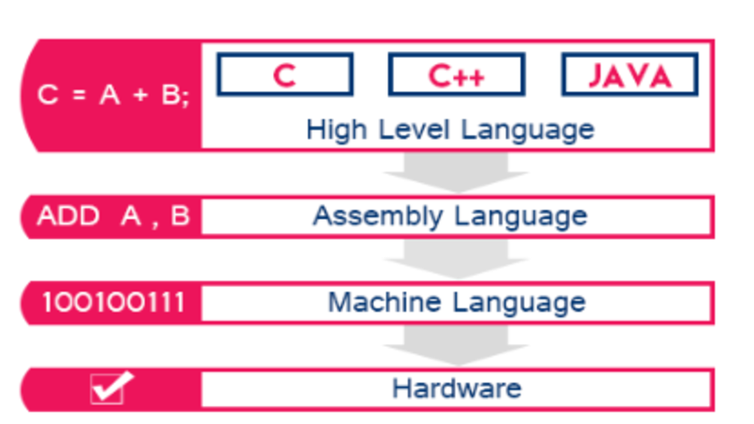

# Python Basics

## Training Agenda
1. **Introduction to Python**
2. **Basic Syntax and Structure**
3. **Variables and Data Types**
4. **Operators**
5. **Control Structures**
6. **Functions**
7. **Error Handling**
8. **Exercise**

---

### Introduction to Python: What is Python?

- Python is a **beginner-friendly** (syntax is simple and intuitive, similar to plain English) **versatile**, & **high-level language** that is widely used across various fields, including web development, data analysis, artificial intelligence, and more.

 
  
- It was created in the late 1980s by **Guido van Rossum** and emphasizes **readability** and **simplicity**, making it one of the most popular languages today (You are resercher/scientist not programmer!).

#### Hello, World, in Different Languages

Assembly Language
```
section  data
    hello db 'Hello, World!',10
    len equ $ - hello

section  text
    global _start

_start:
    ; write our string to stdout
    mov eax, 4         ; sys_write
    mov ebx, 1         ; file descriptor 1 (stdout)
    mov ecx, hello     ; message to write
    mov edx, len       ; message length
    int 0x80           ; syscall
    ; exit
    mov eax, 1         ; sys_exit
    xor ebx, ebx       ; exit status 0
    int 0x80           ; syscall
```

Java Language

```java 
public class HelloWorld {
    public static void main(String[] args) {
        System out println("Hello, World!");
    }
}
```

C Language

```c
#include <stdio h>

int main() {
    printf("Hello, World!\n");
    return 0;
}
```

R Language
```python 
print("Hello, World!")
```

Python Language
```python 
print("Hello, World!")
```

### Key Features of Python

#### Versatility/Multi-Purpose 
- Python can be used for wide range of applications:
   - Building websites.
   - Automating tasks.
   - Analyzing data.
   - Training machine learning models.

#### In-Demand Skill
  - Python ranks among the most popular programming languages in the world.
  - Companies like Google, Netflix, and NASA use Python, making it a valuable skill in the job market.

##### Most Popular Programming Languages from 1965- 2024
<iframe width="560" height="315" src="https://www.youtube.com/embed/xOW3Cehg_qg?si=dR6bCJjmc6yTFPR_" frameborder="0" allowfullscreen></iframe>
    
#### Rich Ecosystem/Extensive Libraries
- Python has thousands of libraries and frameworks to help you:
   - Work with data: Pandas, NumPy.
   - Create visualizations: Matplotlib, Seaborn.
   - Build machine learning models: Scikit-learn, TensorFlow.

#### Collaboration and Community Support/Large Community
- With millions of developers worldwide, you’ll find tutorials, resources, and libraries for almost any task.
- Stuck on a problem? Resources like Stack Overflow and Python forums have answers.

#### Open source
 - Python is an open-source language, meaning it’s freely available for use and modification.

#### Platform-independent
- Python code can run on multiple operating systems, including Windows, Linux, and Mac operating systems.

####  Efficent in development
  - Rapid development, prototyping, and good for experimenting.


### Downsides of Python
  
  - It's `slow`:
    - Python code is interpreted during run time using CPython (line by line) rather than being compiled and executed by the compiler such as Java, C, C++, & Frotran.
    - Dynamically typed language

---

### Basic Syntax and Structure

#### Writing your first Python program

   ```python
     print("Hello, World!")
   ```
  - print(): A built-in function used to display output on the screen.   
  - (""):  The text inside the parentheses in double quotes called a string.  
     

#### Python indentation rules  
- In Python, `indentation` is crucial. It defines the structure of your code.  
- Python uses `whitespace` to organize code block.   
- Typically,  `4 spaces` are used for each level of indentation.  
- If the indentation is incorrect, Python will raise an `IndentationError`.    
    
```python
# Check if a number is positive or not.
number = 10  # Assigning a value to a variable

# This block executes if the condition is true
if number > 0:
    print("The number is positive.")
     
# This block executes if the condition is false
else:
    print("The number is not positive.")
```
     
#### Comments and documentation
- Comments are lines of text in a program that Python ignores during execution.  
- They are used to explain what the code does, making it easier to understand (To explain complex code logic.).  
- To make your code more readable for others (or for your future self!).  
- To temporarily disable a piece of code during debugging.    

##### Single-line Comments

```python
# This is a single-line comment
print("Single-line comments start with a hash (#).")
```

##### Multi-line Comments

```python
"""
This is an example of a multi-line comment.
It can be used to describe a block of code or provide detailed information.
print("Multi-line comments are written using triple quotes.")
"""
```

##### Inline Comments

- Comments can also be placed at the end of a line of code.  

```python
number = 42  # This variable stores the answer to life, the universe, and everything
print(number)
```

---

### Variables and Data Types
#### Declaring variables

- In Python, you can create a variable by simply assigning a value to it using the `=` operator. 
- Python is dynamically typed, variables are created the moment you assign a value to them. You don’t need to declare the variable type explicitly.

##### Declaring and Print variables

```python
name = "yonas"      # String type
print("Name:", name)
```

```python
age = 25             # Integer type
print("Age:", age)
```

```python
height = 5.7         # Float type
print("Height:", height)
```

```python
is_student = True    # Boolean type
print("Is student:", is_student)
```

#### Exploring data types

- Python provides various `built-in data types`.  
- The `type()` function is used to determine the type of a variable or value.  

```python
# Integer example
number = 42
print("The type of", number, "is", type(number))
```

```python
# Float example
pi = 3.14
print("The type of", pi, "is", type(pi))
```

```python
# String example
message = "Hello, Python!"
print("The type of", message, "is", type(message))
```

```python
# Boolean example
is_sunny = False
print("The type of", is_sunny, "is", type(is_sunny))
```

```python
# List example
colors = ["red", "green", "blue"]
print("The type of", colors, "is", type(colors))
```

---

### Operators
1) Arithmetic Operators  
2) Comparison Operators  
3) Logical Operators  

#### Arithmetic Operators
- Arithmetic operators are used to perform mathematical operations  

```python
# Define and y
x = 10
y = 3
```

```python
print("Addition:", x + y)        # Addition
```

```python
print("Subtraction:", x - y)     # Subtraction
```

```python
print("Multiplication:", x * y)  # Multiplication
```

```python
print("Division:", x / y)        # Division
```

```python
print("Floor Division:", x // y) # Floor Division
```

```python
print("Modulus:", x % y)         # Modulus (remainder)
```

```python
print("Exponentiation:", x ** y) # Exponentiation
```

#### Comparison Operators

- Comparison operators are used to compare two values

```python
print("Equal to:", x == y)       # Equal to
```

```python
print("Not equal to:", x != y)   # Not equal to
```

```python
print("Greater than:", x > y)    # Greater than
```

```python
print("Less than:", x < y)       # Less than
```

```python
print("Greater or equal:", x >= y) # Greater than or equal to
```

```python
print("Less or equal:", x <= y)   # Less than or equal to
```

#### Logical Operators

- Logical operators are used to combine conditional statements.

```python
# Define a and b
a = True
b = False
```

```python
print("AND operator:", a and b) # Logical AND
```

```python
print("OR operator:", a or b)   # Logical OR
```

```python
print("NOT operator:", not a)   # Logical NOT
```

---

### Control Structures  

1) If-else Statement  
2) While Loop  
3) For Loop    

#### If-else Statement

- Python evaluates a condition, and based on the result (True/False), it executes one of the code blocks.

```python
# Checking if a number is positive or negative

number = 5  # Assign a number to the variable 'number'

if number > 0:

    # This block will run if the condition (number > 0) is True
    print(f"The number {number} is positive.")

else:

    # This block will run if the condition (number > 0) is False
    print(f"The number {number} is negative.")
```

####  Nested if-else  

- Python evaluates conditions sequentially, stopping once a condition is met.

```python
# Checking if a number is positive, negative, or zero

number = -3  # Change the value to test other cases

if number > 0:
    print(f"The number {number} is positive.")

elif number == 0:
    print("The number is zero.")

else:
    print(f"The number {number} is negative.")
```

#### While Loop  

- The while loop repeats a block of code as long as its condition is True.  
- Used for looping until a condition is False.  

```python
# Start with the number 1
number = 1

while number <= 5:  # The loop runs as long as 'number' is less than or equal to 5

    print(number)  # Print the current value of 'number'

    number += 1  # Increment 'number' by 1 in each iteration
```


#### For Loop  

- Used for looping over a sequence (like a list, range, or string)    

```python

# Print each fruit in the list
fruits = ["apple", "banana", "cherry"]

for fruit in fruits:

    # Loop through each element in the list 'fruits'
    print(f"I like {fruit}")
```

```python
# Print numbers from 1 to 5

for num in range(1, 6):  # range(start, stop) generates numbers from start to stop-1
    print(num)
```
---

### Functions
#### Defining and Calling Functions

- A function is a `reusable` block of code that performs a `specific task`.  
- Defining a Function: Use the `def` keyword followed by the function name and parentheses.
- Calling a Function: Use the function name followed by parentheses, optionally passing arguments.
- Arguments: Functions can accept inputs to make them dynamic.
- Return Values: Functions can return a result using the `return` keyword.  

##### Function without a Parameter

```python 
# Define the function
def greet():
    # This function prints a greeting message
    print("Hello, welcome to the training!")

# Call the function
greet()  # Output: Hello, welcome to the training!
```

##### Function with a Parameter

```python 
# Define the function
def greet_user(name):

    # This function greets the user by their name
    print(f"Hello, {name}! Welcome to the training.")

# Call the function with an argument
greet_user("Yonas")  # Output: Hello, Yonas! Welcome to the training.
```

```python
# Define the function
def add_numbers(a, b):

    # This function returns the sum of two numbers
    return a + b

# Call the function and store the result

result = add_numbers(3, 5)  
print(f"The sum is: {result}")  
```

##### Returning Multiple Values 
```python
# Define the function
def calculate_area_and_perimeter(length, width):

    # This function calculates the area and perimeter of a rectangle
    area = length * width
    perimeter = 2 * (length + width)
    return area, perimeter  # Return both values

# Call the function and unpack the results
area, perimeter = calculate_area_and_perimeter(5, 3)

print(f"Area: {area}, Perimeter: {perimeter}")
```

---
### Error Handling

#### Common Python Errors

- Python errors, also called `exceptions`, occur when something goes wrong during the execution of your program.  
- Understanding these errors is key to debugging.  

##### SyntaxError

- SyntaxError occurs when the Python code violates the syntax rules.
 
```python
# print("Hello  # Missing closing quotation mark

print("Hello")  # Corrected version
```

##### NameError

- NameError happens when you use a variable or function that hasn’t been defined.

```python
print(value)  # Trying to print a variable that hasn't been defined

# Corrected version:
value = 10
print(value)  # Output: 10
```

##### TypeError

- TypeError occurs when an operation is performed on incompatible data types.
  
```python
number = 5
text = "hello"

print(number + text)  # Trying to add a number to a string

# Corrected version:
print(f"{number} {text}")  # Output: 5 hello

```

##### IndexError

- IndexError occurs when you try to access an index that’s out of range in a list or similar data structure.

```python
numbers = [1, 2, 3]

print(numbers[3])  # Accessing an index that doesn't exist

# Corrected version:
print(numbers[2])  
```

### Debugging Basics

- Debugging helps `identify` and `fix` errors in your program.  
- Python provides tools like `try-except` for error handling.
  - We prevent the program from crashing abruptly when an exception occurs.
  - `Graceful Recovery`: We can provide informative error messages or take alternative actions to recover from the error.

#### Catch a specific type of error 

```python
try:
    result = 10 / 0  # Division by zero causes ZeroDivisionError

except ZeroDivisionError: # except block catches specific errors and prevents the program from crashing.
    print("Error: Cannot divide by zero!")
```

#### Catch different types of errors

```python
try:
    value = int("text")  # This will cause a ValueError
except ValueError:
    print("Error: Cannot convert text to an integer!")
except TypeError:
    print("Error: There was a type mismatch!")
```

#### Catch any error

- Using `Exception` catches any type of error.  
- The variable `e` contains information about the error.  

```python
try:
    result = 10 / 0  # This will cause a ZeroDivisionError
except Exception as e:
    print(f"An error occurred: {e}")
```

---

## Exercise

1. Create a loop that prints all the odd numbers between 1 and 20.  
2. Write a function that takes a number and returns its square.  
3. Create a function that takes two numbers and returns their average.  
4. Write a function with a default argument that prints a farewell message (e.g., "Goodbye, Guest!").  
5. Write a program that handles a ValueError when converting user input to an integer.  
6. Use a try-except block to handle a FileNotFoundError when opening a non-existent file.  
7. Debug a program by printing variable values at different points.  

---
