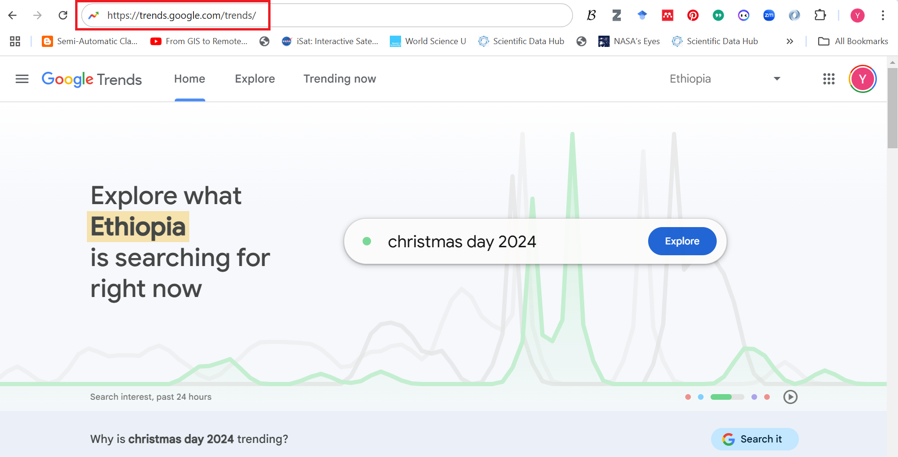
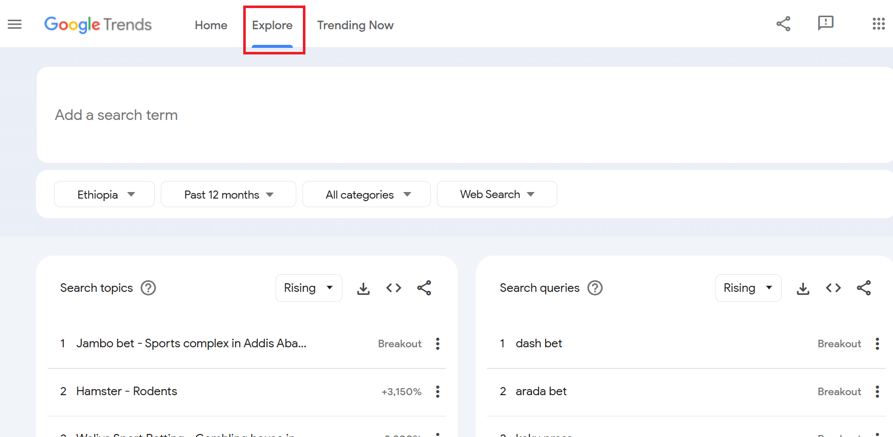
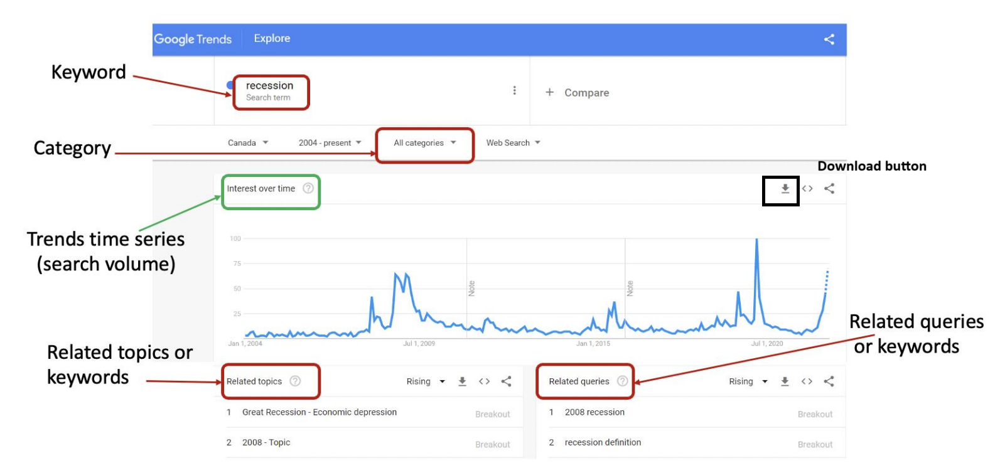

# Introduction to Google Trends Data

`Google Trends` is a powerful tool that provides insights into the relative popularity of search queries over time across various regions and languages. It is widely used to analyze search trends, compare keywords, and explore interest in topics. The data is normalized on a scale of 0 to 100, with 100 representing the peak popularity of a term within the selected parameters.  

Google Trends data is valuable for various applications, including `market research`, `forecasting`, `sentiment analysis`, and `academic research`. By analyzing trends, businesses and researchers can identify patterns, understand user behavior, and make informed decisions based on public interest.

In this project, Google Trends data is used as real-time survey of public sentiment that people's search behavior on Google reflects their current economic situation and concerns. Google Trends help us to know how people are feeling about the economy. For example, during economic booms, consumer confidence is high, leading to increased searches for terms like "loans," "investment opportunities," or "luxury goods." On the other hand, economic downturns (economic crisis) trigger a shift in search behavior towards terms like "unemployment benefits," "debt consolidation," "budgeting tips," or "frugal living." By analyzing these trends, economists can get a sense of how people are feeling about the economy. Essentially, Google Trends provides a real-time window into public sentiment and economic concerns, potentially providing early warnings of economic shifts. When combined with other economic data, it becomes a valuable tool for economists and policymakers.  

Advantages:

- `Near real-time`: Google Trends data offers near real-time insights, potentially leading to faster detection of economic changes compared to traditional indicators with reporting lags.

- `Granularity`: Search data can be geographically specific, allowing for analysis at national or even regional levels.

- `Complementary Data Source`: Google Trends data can be integrated with traditional economic indicators to create a more comprehensive picture of the current economic state.

Limitations:

 - `Causality Challenges`: Correlation doesn't equal causation. Increased searches for "loans" might not directly cause a GDP rise, but could reflect underlying economic conditions.
 
 - `Sentiment vs. Reality`: Search behavior might not always reflect actual economic activity. For example, a surge in searches for "unemployment benefits" could indicate a perceived economic downturn, not necessarily a confirmed one. 
 
 - `External Factors`: Google Trends data needs to be considered alongside other factors like government policies, international trade, and natural disasters for a holistic view.

Key features of Google Trends data include:

- `Interest Over Time`: Displays how search interest in a term changes over a specific period.    
- `Regional Interest`: Shows interest levels by geography, such as countries or cities.  
- `Related Queries and Topics`: Highlights associated search terms and their popularity.  
- `Search Categories and Types`: Enables filtering by category or search type (e.g., web search, image search, YouTube search).  
  
With both manual exploration and automated methods using tools like the pytrends Python library, Google Trends data is accessible and versatile for a wide range of analyses.  

Various research centers and economic institutes have utilized different sets of keywords for their studies. Identifying appropriate keywords for a specific country or geographic region often requires in-depth research. However, here are examples of keywords used by three notable institutions:

1) University of British Columbia (UBC), Canada

- Capstone Project: _Nowcasting Macroeconomic Indicators using Google Trends (2022)_
 - [capstone keywords category](../data/capstone_keywords_category.csv)  
 - [capstone keywords Queries](../data/capstone_keywords_queries.json) 
 - [capstone keywords Topics](../data/capstone_keywords_topics.json)  
  
2) Organisation for Economic Co-operation and Development (OECD)

- _OECD Economics Department Working Papers (2020)_ 
 - [capstone keywords Topics](../data/OECD_keywords.csv)    

3) Institute of Business Administration (IBA), Karachi, Pakistan

- _Nowcasting GDP Growth and Forecasting Inflation of Pakistan, 2021_
 - [capstone keywords Topics](../data/IBA_keywords.xlsx)   

# Download Google Trends Data

## Download Google Tresnds Data  Directly from Google Trends Account.  

Step1 : Logging in with a Google account.  

 - Logging in with a Google account is optional but can provide a smoother experience and help avoid potential limitations during data downloads.
   
Step 2: Open the [Google Trends website](https://trends.google.com/trends/) in your web browser.  

Step 3: Click the Explore button to begin your search.  

Step 4: Search for Keywords. Enter a key term or word in the search bar.  

- Example terms: Economic crisis, Recession, Financial crisis, Inflation, Unemployment. List of Keywords can be found here 

Step 5: Country/Region: Select a specific country.  

Step 6: Time Period: Choose a predefined range (e.g., past 7 days, 12 months) or specify a custom range.    

Step 7: Category: Set to "All Categories" unless a specific category is relevant to your search.    

Step 8: Search Type: Select "Web Search" for general interest trends or adjust to other types like "Image Search" or "YouTube Search" as needed.    

Step 9: Review Data Visualization: Analyze the data presented in various formats, such as interest over time, geographic distribution, and related topics or queries.  

Step 10: Download Data: Click the Download icon in the top-right corner of the chart. The data will be saved in CSV format on your computer. 

Step 11: Open and Analyze the CSV File: Open the file using a spreadsheet application like Google Sheets, Microsoft Excel, or another data analysis tool.  

## Automated Google Tresnds Data Download using web appliction devloped at UNECA

## Automated Google Tresnds Data Download using the `pytrends` Python library

