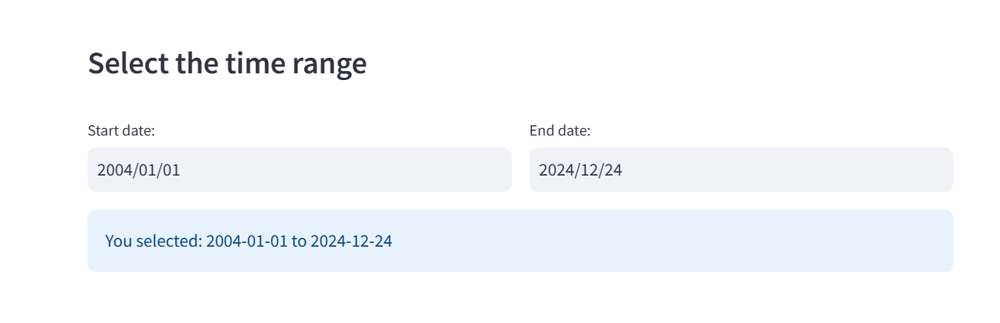

# Introduction to Google Trends Data

`Google Trends` is a powerful tool that provides insights into the relative popularity of search queries over time across various regions and languages. It is widely used to analyze search trends, compare keywords, and explore interest in topics. The data is normalized on a scale of 0 to 100, with 100 representing the peak popularity of a term within the selected parameters.  

Google Trends data is valuable for various applications, including `market research`, `forecasting`, `sentiment analysis`, and `academic research`. By analyzing trends, businesses and researchers can identify patterns, understand user behavior, and make informed decisions based on public interest.

In this project, Google Trends data is used as real-time survey of public sentiment that people's search behavior on Google reflects their current economic situation and concerns. Google Trends help us to know how people are feeling about the economy. For example, during economic booms, consumer confidence is high, leading to increased searches for terms like "loans," "investment opportunities," or "luxury goods." On the other hand, economic downturns (economic crisis) trigger a shift in search behavior towards terms like "unemployment benefits," "debt consolidation," "budgeting tips," or "frugal living." By analyzing these trends, economists can get a sense of how people are feeling about the economy. Essentially, Google Trends provides a real-time window into public sentiment and economic concerns, potentially providing early warnings of economic shifts. When combined with other economic data, it becomes a valuable tool for economists and policymakers.  

Advantages:

- `Near real-time`: Google Trends data offers near real-time insights, potentially leading to faster detection of economic changes compared to traditional indicators with reporting lags.

- `Granularity`: Search data can be geographically specific, allowing for analysis at national or even regional levels.

- `Complementary Data Source`: Google Trends data can be integrated with traditional economic indicators to create a more comprehensive picture of the current economic state.

Limitations:

 - `Causality Challenges`: Correlation doesn't equal causation. Increased searches for "loans" might not directly cause a GDP rise, but could reflect underlying economic conditions.
 
 - `Sentiment vs. Reality`: Search behavior might not always reflect actual economic activity. For example, a surge in searches for "unemployment benefits" could indicate a perceived economic downturn, not necessarily a confirmed one. 
 
 - `External Factors`: Google Trends data needs to be considered alongside other factors like government policies, international trade, and natural disasters for a holistic view.

Key features of Google Trends data include:

- `Interest Over Time`: Displays how search interest in a term changes over a specific period.    
- `Regional Interest`: Shows interest levels by geography, such as countries or cities.  
- `Related Queries and Topics`: Highlights associated search terms and their popularity.  
- `Search Categories and Types`: Enables filtering by category or search type (e.g., web search, image search, YouTube search).  
  
With both manual exploration and automated methods using tools like the pytrends Python library, Google Trends data is accessible and versatile for a wide range of analyses.  

Google Trends Keywords:    

Various research centers and economic institutes have utilized different sets of keywords for their studies. Identifying appropriate keywords for a specific country or geographic region often requires in-depth research. However, here are examples of keywords used by three notable institutions:

1) University of British Columbia (UBC), Canada

- Capstone Project: _Nowcasting Macroeconomic Indicators using Google Trends (2022)_
  
  - [capstone keywords category](../data/capstone_keywords_category.csv)    
  - [capstone keywords Queries](../data/capstone_keywords_queries.json)   
  - [capstone keywords Topics](../data/capstone_keywords_topics.json)    
  
2) Organisation for Economic Co-operation and Development (OECD)

- _OECD Economics Department Working Papers (2020)_
  
  - [capstone keywords Topics](../data/OECD_keywords.csv)      

3) Institute of Business Administration (IBA), Karachi, Pakistan

- _Nowcasting GDP Growth and Forecasting Inflation of Pakistan, 2021_
  
  - [capstone keywords Topics](../data/IBA_keywords.xlsx)     

# Download Google Trends Data

## Download Google Tresnds Data  Directly from Google Trends Account.  

Step1 : Logging in with a Google account.  

 - Logging in with a Google account is optional but can provide a smoother experience and help avoid potential limitations during data downloads.
   
Step 2: Open the [Google Trends website](https://trends.google.com/trends/) in your web browser.  


Step 3: Click the Explore button to begin your search.  


Step 4: Search for Keywords. Enter a key term or word in the search bar.  


- Example terms: Economic crisis, Recession, Financial crisis, Inflation, Unemployment. List of Keywords can be found here 

Step 5: Country/Region: Select a specific country.  

Step 6: Time Period: Choose a predefined range (e.g., past 7 days, 12 months) or specify a custom range.    

Step 7: Category: Set to "All Categories" unless a specific category is relevant to your search.    

Step 8: Search Type: Select "Web Search" for general interest trends or adjust to other types like "Image Search" or "YouTube Search" as needed.    

Step 9: Review Data Visualization: Analyze the data presented in various formats, such as interest over time, geographic distribution, and related topics or queries.  

Step 10: Download Data: Click the Download icon in the top-right corner of the chart. The data will be saved in CSV format on your computer. 

Step 11: Open and Analyze the CSV File: Open the file using a spreadsheet application like Google Sheets, Microsoft Excel, or another data analysis tool.  

---

## Automated Google Tresnds Data Download using web appliction devloped at UNECA

The [`GDP Nowcasting app`](https://mlops-gpd-nowcasting-88t9uagbxrtgq2ajmbpcw4.streamlit.app/) is a web-based application currently being developed at the African Centre for Statistics (ACS) under the United Nations Economic Commission for Africa (UNECA). It is designed to nowcast GDP by utilizing Google Trends data and applying various machine learning algorithms. The app aims to fully automate the GDP nowcasting process, encompassing workflows, deployments, and the integration of diverse machine learning methodologies.  

You can use the web application to download Google Trends data by following these steps: 

Step 1: Open the Web application link


Step 2: Go the Navigation Bar and select Google Trend Data Downloder module 


Step 3: Select a country from the dropdown menu  


Step 4: Choose the desired time range.   



Step 5: Specify keywords either by manually entering them or selecting from the provided dictionary.  


Step 6: Finally, download the data in CSV format. 


Occasionally, the Google Trends API may block downloads due to multiple requests being made in a short period. To address this issue, you can try using a VPN, clearing your browser cache, or reopening the application after some time.  

To overcome this limitation, we pre-downloaded monthly Google Trends data using the Institute of Business Administration (IBA) methodology, covering the period from 2004 to December 20, 2024, for the following countries:


1) [Nigeria](../data/gt_2004-01-01_2024-12-20_NG.csv)    
     
2) [Kenya](../data/gt_2004-01-01_2024-12-20_KE.csv)  
  
3) [Ivory Coast](../data/gt_2004-01-01_2024-12-20_CI.csv)  
     
4) [Cameroon](../data/gt_2004-01-01_2024-12-20_CM.csv)  
   
5) [Egypt](../data/gt_2004-01-01_2024-12-24_EG.csv)  

6) [Mauritius](../data/gt_2004-01-01_2024-12-20_MU.csv)  
   
7) [Ghana](../data/gt_2004-01-01_2024-12-20_GH.csv)    
   
If needed, we can also provide additional keywords from other sources upon request.

---

## Automated Google Tresnds Data Download using the `pytrends` Python library

What is Pytrends?

`Pytrends` is an unofficial Google Trends API for Python. It allows us to extract data of all kinds related to the interest of users in a specific topic or query. 

As in Google’s own tool, we can extract information at a global or geolocated level, in specific time periods and even based on our own categorization of queries.

[Link for Pytrends](https://pypi.org/project/pytrends/)

### Google Trends Data Analysis using Pytrends

#### Step 1: Install Pytrends
First, install the `pytrends` library, which allows you to interact with the Google Trends API.

```python
pip install pytrends
```

##### Step 2: Import Necessary Libraries
Import the required libraries for working with Google Trends data and for visualizing it.

```python
from pytrends.request import TrendReq
import matplotlib.pyplot as plt
```

- `TrendReq`: The main class used to make requests to the Google Trends API.
- `matplotlib.pyplot`: A plotting library used for data visualization.

#### Step 3: Connect to Google Trends
Establish a connection to the Google Trends API.

```python
# Connect to Google Trends
d pytrends = TrendReq(hl='en-US', tz=360)
```

- `hl='en-US'`: Sets the language to English (US).
- `tz=360`: Sets the timezone offset (360 represents UTC+6).

---

#### Step 4: Specify Keywords for Search
Define the list of keywords you want to analyze using Google Trends.

```python
# Keywords to search for
pytrends.build_payload(kw_list=['data science'])
```

- `kw_list=['data science']`: A list containing the keyword(s) to search for.

#### Step 5: Retrieve Data
Fetch the interest over time data for the specified keyword(s).

```python
# Retrieve data
time_df = pytrends.interest_over_time()
```

- `interest_over_time()`: Retrieves the search interest over time as a Pandas DataFrame.

#### Step 6: Preview the Data
View the first few rows of the retrieved data.

```python
time_df.head()
```

- `head()`: Displays the first five rows of the DataFrame.

#### Step 7: Visualize the Data
Create a graph to visualize the trends over time.

```python
# Create a graph
fig, ax = plt.subplots(figsize=(12, 6))
time_df['data science'].plot(color='purple')
```

- `figsize=(12, 6)`: Specifies the size of the figure.
- `time_df['data science']`: Accesses the column corresponding to the keyword "data science".
- `plot(color='purple')`: Plots the data using a purple line.

#### Step 8: Add Titles and Labels
Enhance the graph with a title and axis labels.

```python
# Add title and labels
plt.title('Total Google Searches for "Data Science"', fontweight='bold')
plt.xlabel('Year')
plt.ylabel('Total Count')
```

- `plt.title()`: Sets the graph's title with bold font.
- `plt.xlabel()`: Sets the label for the x-axis.
- `plt.ylabel()`: Sets the label for the y-axis.


#### Final Output
The output will be a graph displaying the total Google searches for "Data Science" over time.


### Parameters for Build Payload in Pytrends

The `build_payload` function in Pytrends has the following parameters:

#### **1. `kw_list`**
- A list of keywords to fetch data for.
- You can specify up to five terms.
  
**Example:**
```python
kw_list = ['Pizza', 'Italian', 'Spaghetti', 'Breadsticks', 'Sausage']
```

#### **2. `cat`**
- The category to narrow down the results.
- Categories can be identified by inspecting the URL when manually using Google Trends.

**Example:** 
Choose a category ID for targeted results, such as food, travel, or technology.

#### **3. `geo`**
- A two-letter country abbreviation to specify the geographical region.
  
**Example:**
```python
geo = 'US'  # United States
geo = 'IN'  # India
```

#### **4. `timeframe`**
- Specifies the date range for the data.
- Use predefined formats or custom datetime ranges.

#### **Predefined Formats:**
- `'today 5-y'`: Data from the last 5 years.
- `'today 3-m'`: Data from today to 3 months ago (works only for 1, 3, or 12 months).
- `'now 7-d'`: Data from the past week (works only for 1 or 7 days).
- `'now 1-H'`: Data from the past hour (works only for 1 or 4 hours).

#### **Custom Date Range:**
- `'YYYY-MM-DD YYYY-MM-DD'`: Data for specific date ranges.
  
**Example:**
```python
'2016-12-14 2017-01-25'
```

#### **All Time Data:**
- `'all'`: Retrieves all available data.

#### **5. `gprop`**
- Specifies the Google property to filter results.

#### **Available Options:**
- `'web'`: Web search (default).
- `'images'`: Google Images.
- `'news'`: Google News.
- `'youtube'`: YouTube.
- `'froogle'`: Google Shopping results.

**Example:**
```python
gprop = 'youtube'  # Fetch trends for YouTube searches.
```

#### Example Usage
```python
pytrends.build_payload(
    kw_list=['Pizza', 'Italian'], 
    cat=0, 
    geo='US', 
    timeframe='today 5-y', 
    gprop='web'
)
```

### Downloading Google Trends Data using list of keywords

#### **Step 1: Define the Keyword List**
Create a list of keywords to analyze in Google Trends.

```python
kw_list = ["crypto", "bitcoin", "ethereum", "AI", "Tesla"]
```

- `kw_list`: A list of up to five keywords or topics to fetch data for.
- Examples in this list include:
  - "crypto": Represents general cryptocurrency searches.
  - "bitcoin": Specific to Bitcoin.
  - "ethereum": Specific to Ethereum.
  - "AI": Related to Artificial Intelligence.
  - "Tesla": Refers to the electric vehicle company.

#### **Step 2: Build Payload**
Pass the keyword list and additional parameters to the `build_payload` function to fetch data.

```python
pytrends.build_payload(kw_list, cat=0, timeframe='today 5-y', geo='US', gprop='')
```

- `kw_list`: Keywords to analyze.
- `cat=0`: Searches across all categories.
- `timeframe='today 5-y'`: Fetches data from the last 5 years.
- `geo='US'`: Limits the data to searches made in the United States.
- `gprop=''`: Default setting for web search. Other options include images, news, YouTube, and Google Shopping.

#### **Step 3: Retrieve Interest Over Time Data**
Fetch the interest over time for the specified keywords.

```python
iot = pytrends.interest_over_time()
```

- `interest_over_time()`: Retrieves the relative popularity of each keyword over the specified time range.
- The result is returned as a Pandas DataFrame.

#### **Step 4: Plot the Data**
Visualize the interest over time data.

```python
iot.plot()
```

- `plot()`: Generates a line plot of the search interest for each keyword.
- Each keyword's trend is represented by a separate line.


#### Final Output
The output will be a line graph showing the relative search interest of the keywords "crypto," "bitcoin," "ethereum," "AI," and "Tesla" in the United States over the last 5 years.


