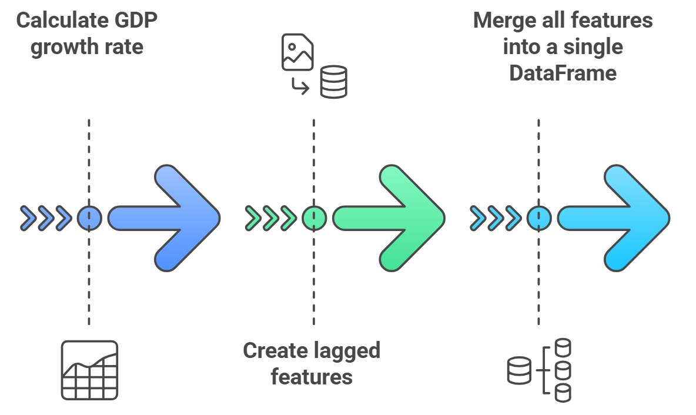
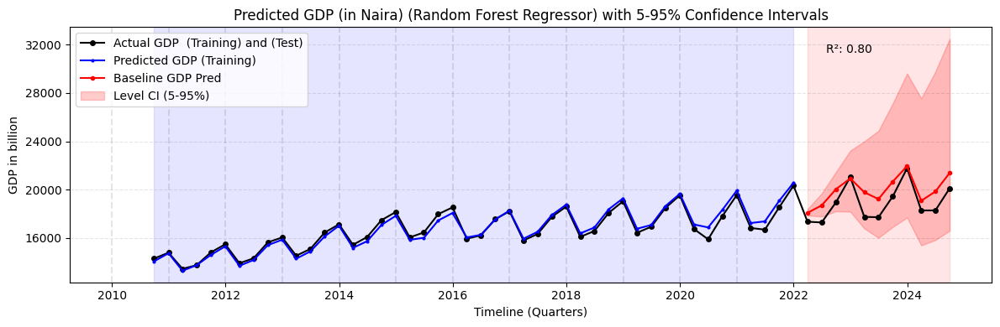

# Leveraging Machine Learning Models and Google Trends Data to Nowcast Nigeria's Quarterly GDP

## Why GDP nowcasting matters

- **Improve timeliness**: Calculating quarterly Gross Domestic Product (GDP) requires data from various sources, including government records and surveys. This data often takes 2-3 weeks even more to become available after the end of each quarter, making it difficult to have a real-time understanding of the economy.

- **Enhance accuracy**: Machine learning can integrate high-frequency data (Google Trends, financial transactions, satellite data) to improve estimates.

- **Optimize resource use**: Reduces dependency on costly and time-consuming traditional surveys by using alternative data sources.

- **Supporting economic policy**: Governments and policymakers need early economic insights (early warning signals) to make informed decisions and get early signals of economic changes for timely interventions. E.g: Governments can respond faster to economic slowdowns or booms.

- **Tracking economic shocks**: Detects economic downturns (e.g., COVID-19 impact, financial crises) before official statistics confirm them.
  
- **Improving investor confidence**: Real-time GDP estimates allow investors to make better decisions about trade, foreign direct investment (FDI), and market stability.

## Objective 

`Train` and compare machine learning models that leverage `Google Trends` data to forecast Nigeria's `quarterly GDP` that helps policymakers and businesses react faster than waiting for official GDP releases.

## GDP Nowcasting Workflow

 - **Data Preparation** is where various data sources such as `GDP` and `Google Trends` time series are compiled into a single consistent dataset.
 - **Preprocessing** adjusts the raw data (e.g., monthly to quarterly alignment, normalization, detrending, and seasonality removal) to isolate meaningful signals.
 - **Feature Engineering** creates new variables or transforms existing ones (like lagged Trends features) to better capture predictive relationships.
 - **Train-Test Split** preserving some recent quarters for out-of-sample validation.
 - **Model Training & Forecasting** uses multiple machine learning algorithms on the training set.
 - **Hyperparameter Tuning & Cross-Validation** refines each model's parameters for optimal performance.
 - **Model Uncertainty** using methods shuch as bootstraping to quantify predictive reliability
 - **Model Evaluation** compares metrics like R² or MSE across models.
 - **Visualization** displays forecast results, confidence intervals, and essential insights for decision-makers.

### **Data Collection & Preparation**
   - **Data Sources**
     - **Quarterly Gross Domestic Product (GDP)**: Official quarterly Gross Domestic Product (GDP) data obtained from the Nigerian Bureau of Statistics (NBS) spanning the years 2010 to 2024. The data can be found at this [link](../data/gt_2010-01-01_2024-12-16_NG.csv).

The chart bellow shows Nigeria's quarterly GDP (in billions of Naira) from 2010 through 2024. Overall, GDP demonstrates a steady upward trend, reflecting growth in the country's economic output over time. However, seasonal or cyclical fluctuations appear each year. By 2024, GDP has climbed to nearly twice its 2010 level, underscoring significant long-term expansion despite intermittent short-term fluctuations. 

  

     
   - **Google Trends**: Google Trends data for Nigeria was harvested from the [Google Trends](https://trends.google.com/trends/) dataset for the same period utilizing a [web application](https://mlops-gpd-nowcasting-88t9uagbxrtgq2ajmbpcw4.streamlit.app/) developed internally within the African Centre for Statistics (ACS) to facilitate the Google Trends data collection.

  - **Data Loading**
    - Load raw datasets (GDP & Google Trends time-series data).
    - Check for missing values & detect anomalies.

### **Data Preprocessing Steps**

**Data Aggregation** involves converting monthly Google Trends data into quarterly. **Normalization/Standardization** then adjusts each variable to a common scale, so large-value features don't dominate the model. Next, **Trend Removal** strips away long-term upward or downward drifts in GDP, letting us focus on short-term or cyclical fluctuations. Finally, **Seasonality Removal** subtracts repeating seasonal effects such as quarter-to-quarter spikes so the underlying patterns in the data are more apparent for accurate nowcasting.
   

   
### **Feature Engineering Process**

This workflow begins by calculating the GDP growth rate from raw GDP data, establishing the main economic performance indicator. Next, we create lag features shifting variables by one or more quarters to capture predictive relationships over time. Finally, we merge all features (including the newly generated lags) into a single dataset, enabling seamless modeling and analysis.

This plot presents the quarterly GDP growth rates from 2010 to 2024, clearly demonstrating a recurring pattern of substantial peaks and troughs that appear to occur annually.
 

                                
### **Train–Test Split**

The final dataset was partitioned into a training set (80%) covering the period from `2010-09-30 to 2021-12-31` and 20% from `2022-03-31 to 2024-09-30` for out-of-sample (test set).

 
### **Model Training & Forecasting**

Nine (9) different machine learning algorithms were trained on the final data set. 

Two forecasting methods were employed: 
 - **One-step forecast**: a one-step ahead prediction for the training data
 - **Rolling forecast**: a rolling forecast approach for the out-of-sample test data.

The implementation notebooks for each of the nine models are available bellow. You are welcome to modify or improve them. 

| ML Models                   |
|-----------------------------|
| [LGBM Regressor](../code/lgbm_gdp_forecast_ng.ipynb)               |
| [Extra Trees Regressor](../code/et_gdp_forecast_ng.ipynb)       | 
| [Random Forest Regressor](../code/rf_gdp_forecast_ng.ipynb)     | 
| [ElasticNet Regressor](../code/en_gdp_forecast_ng.ipynb)        | 
| [XGBoost Regressor](../code/xgb_gdp_forecast_ng.ipynb)           | 
| [Gradient Boosting Regressor](../code/gbr_gdp_forecast_ng.ipynb) | 
| [Lasso Regressor](../code/lr_gdp_forecast_ng.ipynb)             | 
| [Decision Tree Regressor](../code/dt_gdp_forecast_ng.ipynb)     | 
| [Ridge Regressor](../code/rr_gdp_forecast_ng.ipynb)             | 

### **Hyperparameter Tuning & Cross Validation**

**Optimization**: Hyperparameter optimization was achieved through an exhaustive grid search approch over a predefined parameter space.
     
**Cross-Validation Strategy**: Time-series cross-validation, such as sklearn.TimeSeriesSplit, was employed to ensure robust performance evaluation.

### **Model Evaluation**

The `coefficient of determination (R²)` was calculated for both the training and test datasets. The reported R-squared value reflects the model's performance on the held-out test set.

| ML Models                   | R2    |
|-----------------------------|-------|
| LGBM Regressor               | 0.868 |
| Extra Trees Regressor        | 0.856 |
| Random Forest Regressor      | 0.798 |
| ElasticNet Regressor         | 0.790 |
| XGBoost Regressor            | 0.780 |
| Gradient Boosting Regressor  | 0.775 |
| Lasso Regressor              | 0.732 |
| Decision Tree Regressor      | 0.688 |
| Ridge Regressor              | 0.646 |

### **Model Uncertainty** (Confidence Intervals)

`Non-parametric bootstrap resampling` was used to estimate `5-95% confidence intervals` for the model's predictions.

### **Visualization**

Actual and predicted GDP time series were compared graphically, with the forecast uncertainty represented by shaded confidence intervals. 

**Training Period**: 
  - Black lines with circles = actual official GDP,
  - blue line = predicted GDP for training (in-sample).

**Test Period**: 
  - The black lines with circles continuing into the future are actual data.
  - The red line is the predicted GDP.

**Confidence Interval (Shaded Area)**: Using bootstrap, we bracket the potential future GDP from the 5th to 95th percentile. This range accounts for model and sampling uncertainty.  The shaded confidence intervals reflect uncertainty critical for policymakers to hedge risks. 

## Key Insights 

**LGBM Regressor**

The plot illustrates the predicted GDP (in Naira) using an LGBM Regressor, incorporating 5-95% confidence intervals over a quarterly timeline. The actual GDP values are represented by the black line with dots, covering both the training and test periods. The blue line indicates the model’s predictions during the training phase, demonstrating how well it fits historical data. The red line represents the GDP nowcasting for the future period, with a shaded red region highlighting the uncertainty range. The blue-shaded area corresponds to the training period, while the red-shaded region reflects the confidence interval for future predictions, showing increasing uncertainty over time. The model achieves an R² score of 0.87, indicating a strong fit, explaining 87% of the variance in GDP. Overall, the model effectively captures seasonal and trend patterns, making it reliable for short-term forecasting, though the widening confidence intervals suggest that caution is needed when interpreting long-term projections.

**Extra Trees Regressor**

The Extra Trees Regressor model achieves an R² score of 0.86, suggesting a strong fit, explaining 86% of the variance in GDP. Compared to the previous LGBM model, this Extra Trees model exhibits more rigid step-like predictions, a characteristic of tree-based models.

**Random Forest Regressor**
The Random Forest Regressor achieved a high R-squared of 0.80, explaining 80% of the variance in GDP. This suggests a strong fit to the data. Relative to other models evaluated, Random Forest demonstrated a commendable balance between accurately capturing historical GDP trends and acknowledging inherent model uncertainty.

**ElasticNet Regressor**
The ElasticNet Regressor achieved an R-squared of 0.79, explaining 79% of the GDP variance, but indicating a slightly weaker fit compared to previous models. While the model follows the general GDP trend, the widening confidence intervals, coupled with the lower R-squared, suggest increased uncertainty in future predictions, particularly for longer forecasting horizons.

**XGBoost Regressor**
The XGBoost model achieved an R-squared of 0.78, indicating a reasonable fit to the historical GDP data, explaining 78% of the variance. However, its performance was slightly lower than Random Forest and Extra Trees. While XGBoost effectively models past trends, the widening confidence intervals after 2022 suggest that near-term forecasts are more reliable than long-term projections.

**Gradient Boosting Regressor**
The Gradient Boosting Regressor demonstrated a coefficient of determination (R-squared) of 0.78, indicating a strong fit to the historical GDP data, comparable to that of the XGBoost model, explaining 78% of the variance. However, the widening confidence intervals post-2022 underscore the increasing uncertainty associated with long-term forecasts. Despite the model's strong performance on historical data, caution should be exercised when interpreting predictions beyond the near term.

**Lasso Regressor**
The Lasso Regression model, exhibiting an R-squared of 0.73, demonstrates a marginally lower fit compared to models such as Gradient Boosting and XGBoost, accounting for 73% of the variance in GDP. 

**Decision Tree Regressor**
The Decision Tree model exhibited a coefficient of determination (R-squared) of 0.69, indicating a weaker fit compared to models such as Gradient Boosting, Random Forest, and LGBM, accounting for 69% of the variance in GDP. 

**Ridge Regressor**
The Ridge Regression model achieved a coefficient of determination (R-squared) of 0.65, explaining 65% of the variance in GDP. This indicates a weaker fit compared to models such as Gradient Boosting, LGBM, and Random Forest. 

## Future Enhancements

- **Real-Time Dashboard**: Integrate these predictions into a live Streamlit or Power BI interface so stakeholders can see updated forecasts.
  
- **More Google Trends Terms**: Exploring domain-specific searches (e.g., agriculture, oil, manufacturing).
  
- **Advanced deep learning time-Series models**: We could try advanced `deep learning time series models` such as Recurrent Neural Network, Long Short Term Memory, Gated Recurrent Unit, Transformer , Temporal Fusion Transformer, Encoder decoder LSTM, Sequence to Sequences with attention structures to capture seasonality more directly.

## Final Wrap

By combining `Google Trends signals` and `advanced ML models`, we achieved `~87%` accuracy (R²) in nowcasting Nigeria’s GDP, offering an actionable, real-time vantage on economic performance.
