# Leveraging Machine Learning Models and Google Trends Data to Nowcast Nigeria's Quarterly GDP

## Why GDP nowcasting matters

- **Improve timeliness**: Calculating quarterly Gross Domestic Product (GDP) requires data from various sources, including government records and surveys. This data often takes 2-3 weeks even more to become available after the end of each quarter, making it difficult to have a real-time understanding of the economy.

- **Enhance accuracy**: Machine learning can integrate high-frequency data (Google Trends, financial transactions, satellite data) to improve estimates.

- **Optimize resource use**: Reduces dependency on costly and time-consuming traditional surveys by using alternative data sources.

- **Supporting economic policy**: Governments and policymakers need early economic insights (early warning signals) to make informed decisions and get early signals of economic changes for timely interventions. E.g: Governments can respond faster to economic slowdowns or booms.

- **Tracking economic shocks**: Detects economic downturns (e.g., COVID-19 impact, financial crises) before official statistics confirm them.
  
- **Improving investor confidence**: Real-time GDP estimates allow investors to make better decisions about trade, foreign direct investment (FDI), and market stability.

## Objective 

`Train` and compare machine learning models that leverage `Google Trends` data to forecast Nigeria's `quarterly GDP` that helps policymakers and businesses react faster than waiting for official GDP releases.

## GDP Nowcasting Workflow

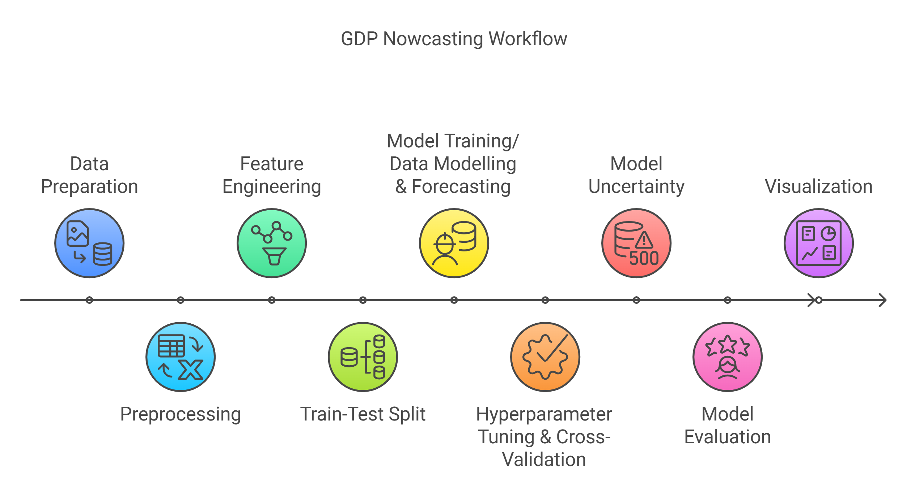

### **Data Collection & Preparation**
   - **Data Sources**
     - **Quarterly Gross Domestic Product (GDP)**: Official quarterly Gross Domestic Product (GDP) data obtained from the Nigerian Bureau of Statistics (NBS) spanning the years 2010 to 2024. The data can be found at this [link](../data/gt_2010-01-01_2024-12-16_NG.csv).  

  
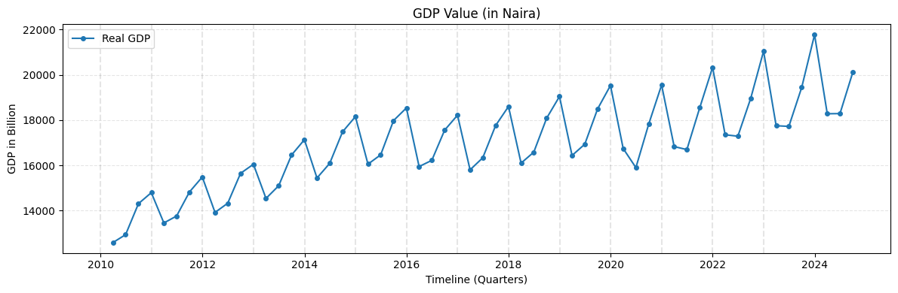
     
   - **Google Trends**: Google Trends data for Nigeria was harvested from the [Google Trends](https://trends.google.com/trends/) dataset for the same period utilizing a [web application](https://mlops-gpd-nowcasting-88t9uagbxrtgq2ajmbpcw4.streamlit.app/) developed internally within the African Centre for Statistics (ACS) to facilitate the Google Trends data collection.

  - **Data Loading**
    - Load raw datasets (GDP & Google Trends time-series data).
    - Check for missing values & detect anomalies.

### **Data Preprocessing Steps**
   
   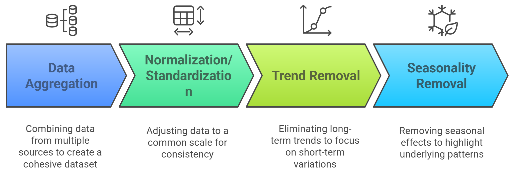
   
### **Feature Engineering Process**
   
 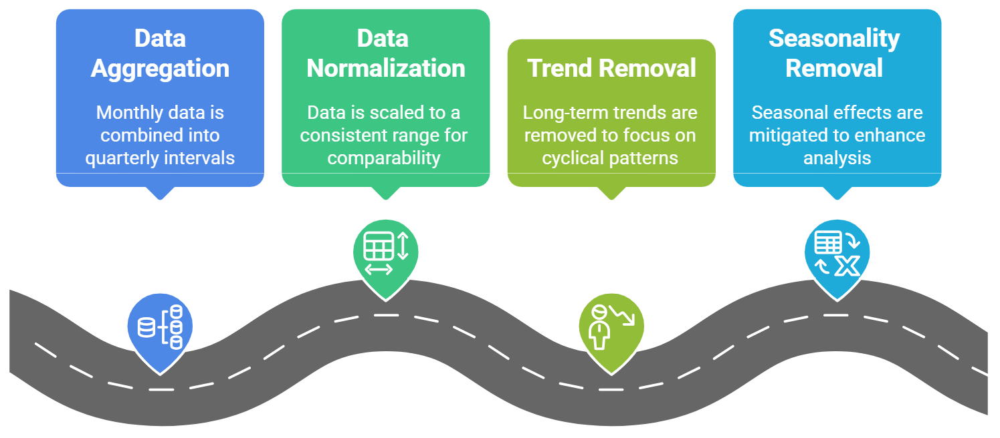
 
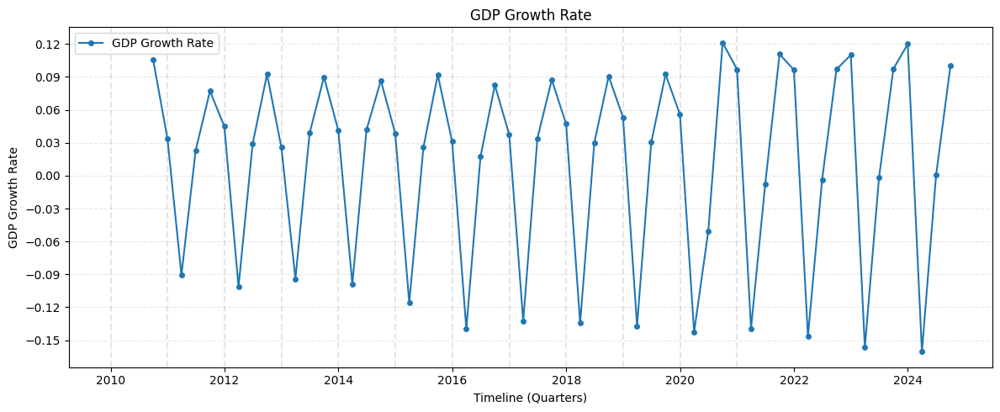
                                
### **Train–Test Split**

The final dataset was partitioned into a training set (80%) covering the period from `2010-09-30 to 2021-12-31` and 20% from `2022-03-31 to 2024-09-30` for out-of-sample (test set).

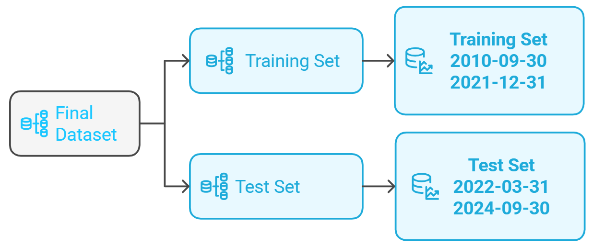
 
### **Model Training & Forecasting**

Nine different machine learning algorithms were trained on the final data set. 
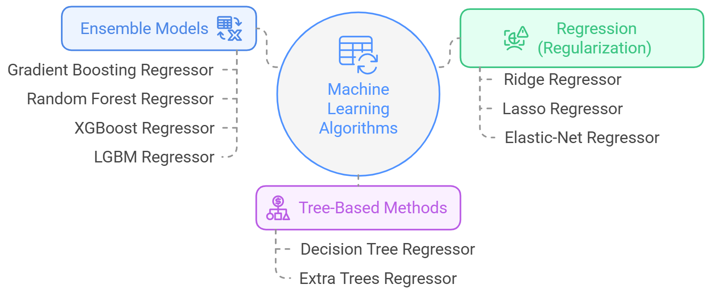

Two forecasting methods were employed: 
 - **One-step forecast**: a one-step ahead prediction for the training data
 - **Rolling forecast**: a rolling forecast approach for the out-of-sample test data.

The implementation notebooks for each of the nine models are available bellow. You are welcome to modify or improve them. 

| ML Models                   |
|-----------------------------|
| [LGBM Regressor](../code/lgbm_gdp_forecast_ng.ipynb)               |
| [Extra Trees Regressor](../code/et_gdp_forecast_ng.ipynb)       | 
| [Random Forest Regressor](../code/rf_gdp_forecast_ng.ipynb)     | 
| [ElasticNet Regressor](../code/en_gdp_forecast_ng.ipynb)        | 
| [XGBoost Regressor](../code/xgb_gdp_forecast_ng.ipynb)           | 
| [Gradient Boosting Regressor](../code/gbr_gdp_forecast_ng.ipynb) | 
| [Lasso Regressor](../code/lr_gdp_forecast_ng.ipynb)             | 
| [Decision Tree Regressor](../code/dt_gdp_forecast_ng.ipynb)     | 
| [Ridge Regressor](../code/rr_gdp_forecast_ng.ipynb)             | 

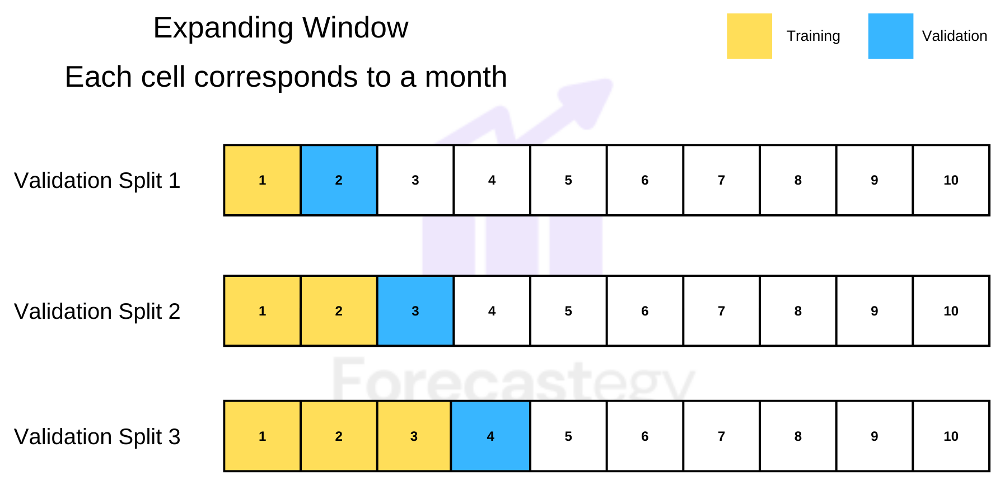

### **Hyperparameter Tuning & Cross Validation**

**Optimization**: Hyperparameter optimization was achieved through an exhaustive grid search approch over a predefined parameter space.
     
**Cross-Validation Strategy**: Time-series cross-validation, such as sklearn.TimeSeriesSplit, was employed to ensure robust performance evaluation.

### **Model Evaluation**

The `coefficient of determination (R²)` was calculated for both the training and test datasets. The reported R-squared value reflects the model's performance on the held-out test set.

| ML Models                   | R2    |
|-----------------------------|-------|
| LGBM Regressor               | 0.868 |
| Extra Trees Regressor        | 0.856 |
| Random Forest Regressor      | 0.798 |
| ElasticNet Regressor         | 0.790 |
| XGBoost Regressor            | 0.780 |
| Gradient Boosting Regressor  | 0.775 |
| Lasso Regressor              | 0.732 |
| Decision Tree Regressor      | 0.688 |
| Ridge Regressor              | 0.646 |

### **Model Uncertainty** (Confidence Intervals)

`Non-parametric bootstrap resampling` was used to estimate `5-95% confidence intervals` for the model's predictions.

### **Visualization**

Actual and predicted GDP time series were compared graphically, with the forecast uncertainty represented by shaded confidence intervals. 

**Training Period**: 
  - Black lines with circles = actual official GDP,
  - blue line = predicted GDP for training (in-sample).

**Test Period**: 
  - The black lines with circles continuing into the future are actual data.
  - The red line is the predicted GDP.

**Confidence Interval (Shaded Area)**: Using bootstrap, we bracket the potential future GDP from the 5th to 95th percentile. This range accounts for model and sampling uncertainty.  The shaded confidence intervals reflect uncertainty—critical for policymakers to hedge risks. 

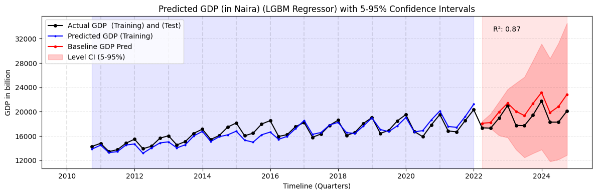

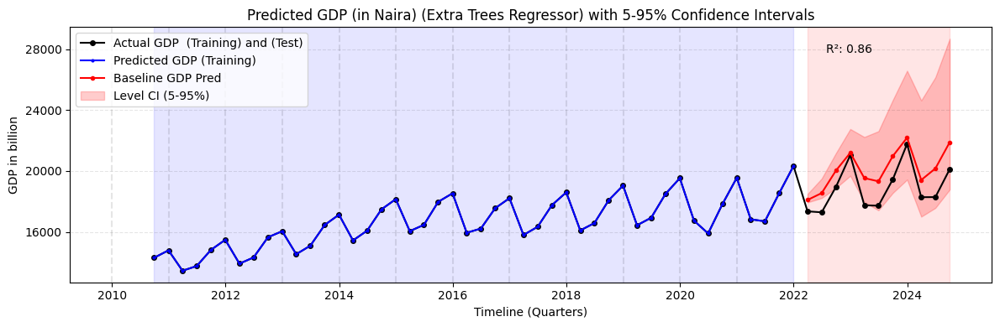

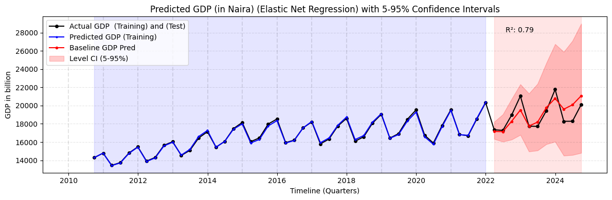

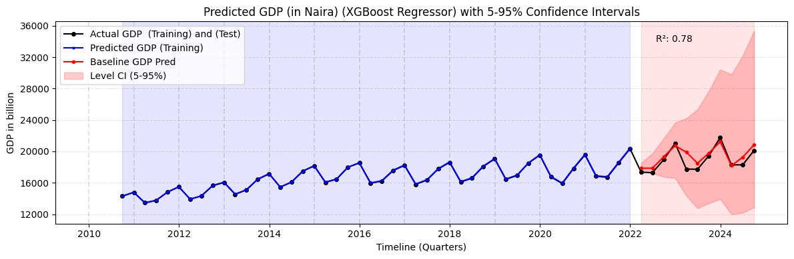

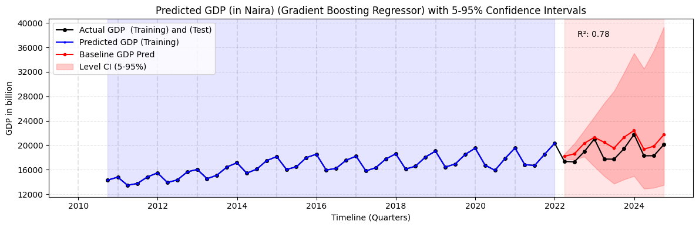

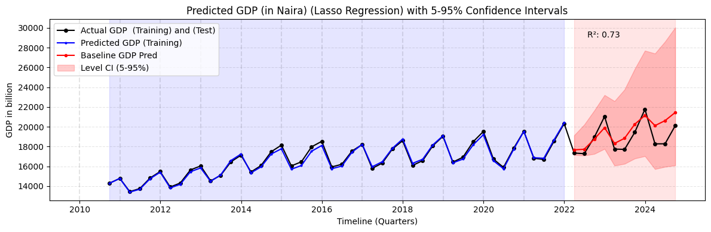

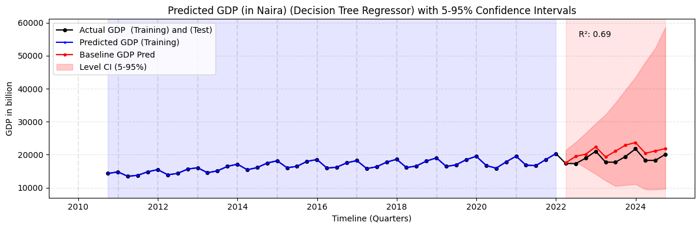

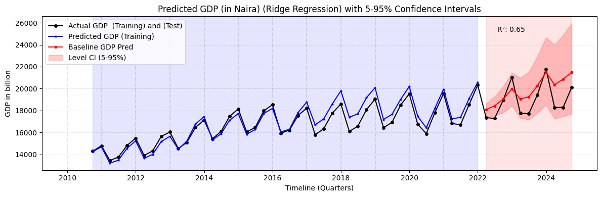

## Key Results

`LGBM Regressor` achieved an R-squared value of `0.868`, indicating it explained ~86.8% of GDP variance on the test set. `ExtraTreesRegressor` was at 0.856, also quite strong. Models like Decision Tree or Ridge had lower R², possibly underfitting the data or lacking enough complexity.

## Future Enhancements

- **Real-Time Dashboard**: Integrate these predictions into a live Streamlit or Power BI interface so stakeholders can see updated forecasts.
  
- **More Google Trends Terms**: Exploring domain-specific searches (e.g., agriculture, oil, manufacturing).
  
- **Advanced deep learning time-Series models**: We could try advanced `deep learning time series models` such as Recurrent Neural Network, Long Short Term Memory, Gated Recurrent Unit, Transformer , Temporal Fusion Transformer, Encoder decoder LSTM, Sequence to Sequences with attention structures to capture seasonality more directly.

## Final Wrap

By combining `Google Trends signals` and `advanced ML models`, we achieved `~87%` accuracy (R²) in nowcasting Nigeria’s GDP, offering an actionable, real-time vantage on economic performance.
