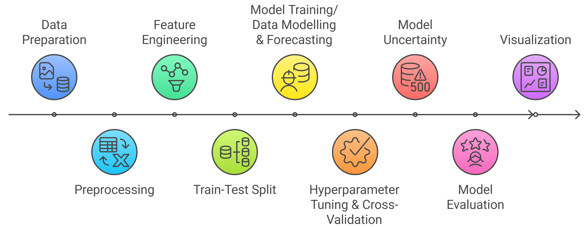
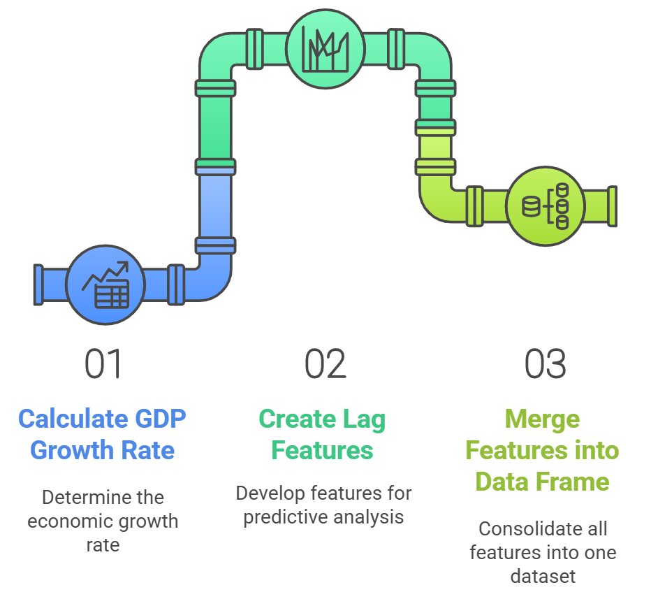

# Nowcasting Nigeria's GDP with Machine Learning and Google Trends Data

## Why GDP nowcasting matters

- **Improve timeliness**: Calculating quarterly Gross Domestic Product (GDP) requires data from various sources, including government records and surveys. This data often takes 2-3 weeks even more to become available after the end of each quarter, making it difficult to have a real-time understanding of the economy.

- **Enhance accuracy**: Machine learning can integrate high-frequency data (Google Trends, financial transactions, satellite data) to improve estimates.

- **Optimize resource use**: Reduces dependency on costly and time-consuming traditional surveys by using alternative data sources.

- **Supporting economic policy**: Governments and policymakers need early economic insights (early warning signals) to make informed decisions and get early signals of economic changes for timely interventions. E.g: Governments can respond faster to economic slowdowns or booms.

- **Tracking economic shocks**: Detects economic downturns (e.g., COVID-19 impact, financial crises) before official statistics confirm them.
  
- **Improving investor confidence**: Real-time GDP estimates allow investors to make better decisions about trade, foreign direct investment (FDI), and market stability.

# Leveraging Machine Learning models and Google Trends data to nowcast Nigeria's quarterly GDP

## GDP Nowcasting Workflow

### **Data Collection & Preparation**
   - **Data Sources**
     - **Quarterly Gross Domestic Product (GDP)**: Official quarterly Gross Domestic Product (GDP) data obtained from the Nigerian Bureau of Statistics (NBS) spanning the years 2010 to 2024.
  

     
   - **Google Trends**: Google Trends data for Nigeria was harvested from the [Google Trends](https://trends.google.com/trends/) dataset for the same period utilizing a [web application](https://mlops-gpd-nowcasting-88t9uagbxrtgq2ajmbpcw4.streamlit.app/) developed internally within the African Centre for Statistics (ACS) to facilitate the Google Trends data collection.

  - **Data Loading**
    - Load raw datasets (GDP & Google Trends time-series data).
    - Check for missing values & detect anomalies.

### **Data Preprocessing**
   
   
   
### **Feature Engineering**
   
 
 

                                
### **Train–Test Split**

   - The final dataset was partitioned into a training set (80%) covering the period from `2010-09-30 to 2021-12-31` and 20% from `2022-03-31 to 2024-09-30` for out-of-sample (test set).

### **Model Training & Forecasting**

   - 10 Machine learning models trained on the training set.
     - **Machine Learning Models**: A diverse set of machine learning models, including `Ridge regression`, `Lasso regression`, `ElasticNet regression`, `K-Nearest Neighbors`, `Decision Tree`, `Extra Trees`, `Gradient Boosting`, `Random Forest`, `XGBoost`, and `LightGBM`, were employed for model training.
   
   - **Rolling Prediction**: A rolling predictions performed on the test set.

### **Hyperparameter Tuning & Cross Validation**

   - **Optimization**: Grid search is used to find the best parameters.
   - **Cross-Validation Strategy**: Time-series CV (e.g., sklearn.TimeSeriesSplit).

### **Model Evaluation**
   - Calculate evaluation marices (R²) on both the training set and out-of-sample test set.
  
### **Model Uncertainty** (Confidence Intervals)

   - Employed bootstrap resampling on the final model’s predictions, deriving 5–95% intervals.
     
### **Visualization**
    - Compared actual vs. predicted GDP levels over time, shading the forecast intervals.

## Key Results

## Future Enhancements

## Final Wrap
